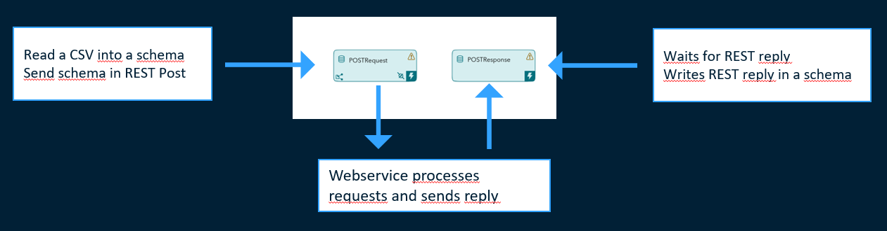
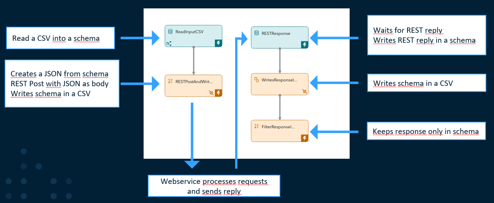
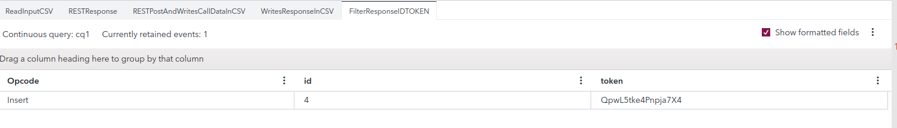
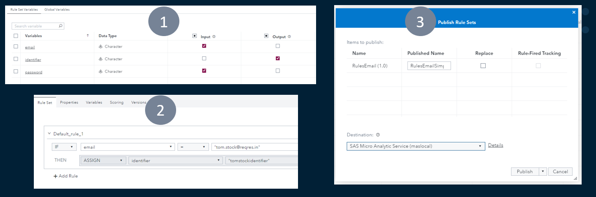
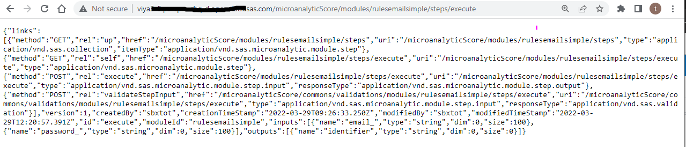
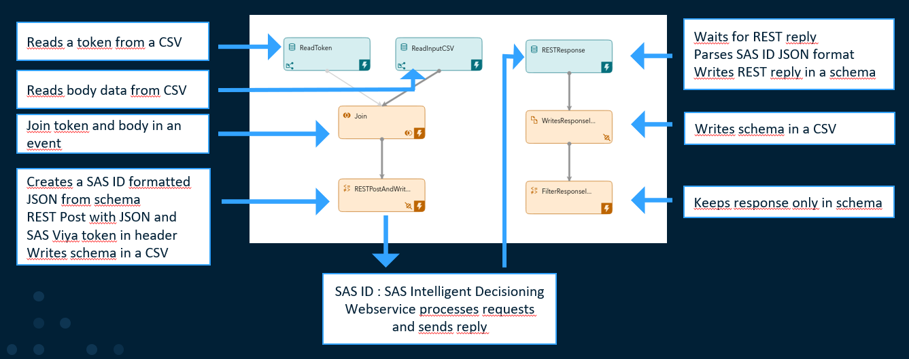
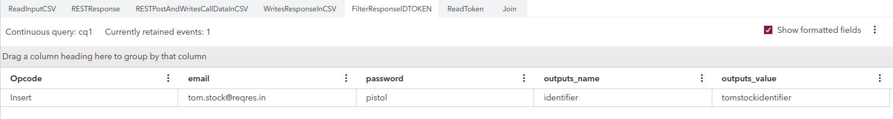

# How to use the REST Subscriber Adapter in SAS ESP

A functional description with some example on how to call REST APIs with the REST Subscriber Adapter in SAS ESP including calling the REST API of SAS Intelligent Decisioning.

## Table of Contents

* [Overview](#overview)
  * [REST API Post](#rest-api-post)
    * [POSTRequest](#postrequest)
    * [POSTResponse](#postresponse)
  * [REST API Post with opaque JSON](#rest-api-post-with-opaque-json) 
    * [ReadInputCSV](#readinputcsv)
    * [RESTPostAndWritesCallDataInCSV](#restpostandwritescalldataincsv)
    * [RESTResponse](#restresponse)
    * [WritesResponseInCSV](#writesresponseincsv)
    * [FilterResponseIDTOKEN](#filterresponseidtoken)
  * [REST API Post to SAS Intelligent Decisioning with opaque JSON and token](#rest-api-post-to-sas-intelligent-decisioning-with-opaque-json-and-token) 
    * [Prerequisites SAS Viya Token](#prerequisites-sas-viya-token)
    * [Prerequisites SAS Intelligent Decisioning](#prerequisites-sas-intelligent-decisioning)
    * [REST API Post to SAS Intelligent Decisioning Model overview](#rest-api-post-to-sas-intelligent-decisioning-model-overview)
    * [ReadToken](#readtoken)
    * [ReadInputCSV](#readinputcsv)
    * [Join](#join)
    * [RESTPostAndWritesCallDataInCSV](#restpostandwritescalldataincsv)
    * [RESTResponse](#restresponse)
    * [WritesResponseInCSV](#writesresponseincsv)
    * [FilterResponseIDTOKEN](#filterresponseidtoken)
    * [REST API Post to SAS Intelligent Decisioning in Viya 4](#rest-api-post-to-sas-intelligent-decisioning--in-viya-4)   
* [Summary](#summary)   
* [Contributing](#contributing)
* [License](#license)
* [Additional Resources](#additional-resources)
                        

## Overview
The objective is to complement the official SAS documentation of the REST Subscriber Adapter https://go.documentation.sas.com/doc/en/espcdc/v_021/espca/n0jm4fbcrh370on1j3d4w0xpl9xr.htm?homeOnFail

### REST API Post 

The first example enables to POST a request with an email address and a password, that is formatted into JSON file by the REST Adapter Susbscriber, and the response includes an ID and a token. The webservice uses the POST register from this public api https://reqres.in/ . You can find the corresponding ESP model in espmodels/RESTPost.xml .

#### POSTRequest 

POSTRequest has one publisher connector that reads a CSV file that contains email addresses and passwords register.csv

            <fields>
              <field name="email" type="string" key="true"/>
              <field name="password" type="string" key="true"/>
            </fields>

POSTRequest has one subscriber adapter connector that calls the webservice with a json that contains the email and the password:

    dfesp_rest_subscriber -C 
    resturl=https://reqres.in/api/register,
    httpcontenttype=application/json,
    url=dfESP://<yourespserver>:31416/RESTPost/cq1/POSTRequest?snapshot=true,
    esprespurl=dfESP://<yourespserver>:31416/RESTPost/cq1/POSTResponse,
    httpstatuscodes=200

resturl contains the address of the public REST webservice
httpcontenttype indicates the request body format is JSON, so the adapter transforms the schema into {"email":"tom.stock@reqres.in","password":"pistoleto"} for you 
url is the window of the esp project from which the adapter must take the schema data from, in this case this is the same window
esperespurl is the window where the response from the webservice must be sent 

Attention point:
url uses the pubsubport and not the httpport, by default 31416
the ip in the url and esprespurl is the ip of the server you are using
the password does not matter for the webservice, it can be any value, it only uses the email value
the http status code is important, if you don't include it in your subscriber, the response will not be written in your window. 

#### POSTResponse

POSTResponse does not need a connector and is simply waiting for its schema to be filled with the responses. The response is an ID and a token.

            <fields>
              <field name="email" type="string" key="true"/>
              <field name="password" type="string" key="true"/>
              <field name="id" type="int32"/>
              <field name="token" type="string"/>
            </fields>

Attention point:
The schema must include also the fields sent by the request, in this case email and password, and always in the same order. 

### REST API Post with opaque JSON 

The example enables to POST a request with an email address and a password, that is formatted using a functional window into a JSON file and submitted as opaquejson by the REST Adapter Subscriber, and the response includes an ID and a token. The webservice uses the POST register from this public api https://reqres.in/ . You can find the corresponding ESP model in espmodels/RESTPostJSON.xml .

Attention point:
I document each step with CSVs in order to see the content of the calls because ESP Studio currently does not display field values of a whole schema when there is a JSON string in the schema. 

#### ReadInputCSV 

ReadInputCSV has one publisher connector that reads a CSV file that contains email addresses and passwords registerjson.csv

            <fields>
              <field name="email" type="string" key="true"/>
              <field name="password" type="string" key="true"/>
            </fields>

#### RESTPostAndWritesCallDataInCSV

RESTPostAndWritesCallDataInCSV is a functional window that creates a JSON Body, posts this body to the REST API and writes the post data into a CSV.

            <fields>
              <field name="email" type="string" key="true"/>
              <field name="password" type="string" key="true"/>
              <field name="JSONRESTbody" type="string"/>
            </fields>

Note that JSONRESTbody is in string format. 

            <functions>
              <function name="JSONRESTbody"><![CDATA[concat('{"email":"',$email,'","password":"',$password,'"}')]]></function>
            </functions>

The JSONRESTbody is created with a concatenation function that takes the value from email and password. Note that calling the field value requires the prefix <',$> and the suffix <,>   

    dfesp_rest_subscriber -C 
    url="dfESP://<yourespserver>:31416/RESTPostJSON/cq1/RESTPostAndWritesCallDataInCSV?snapshot=true",
    httpcontenttype=application/json,
    resturl=https://reqres.in/api/register,httpcontenttype=application/json,
    esprespurl="dfESP://<yourespserver>:31416/RESTPostJSON/cq1/RESTResponse",
    opaquejson=JSONRESTbody,
    httpstatuscodes=200

In the REST Adapter Subscriber, we add the option opaquejson=JSONRESTbody which uses the JSON we just constructed. 

    <connector class="fs" name="writefile">
      <properties>
        <property name="type"><![CDATA[sub]]></property>
        <property name="snapshot"><![CDATA[false]]></property>
        <property name="fsname"><![CDATA[/opt/tutorials/files/jsoncalldata.csv]]></property>
        <property name="fstype"><![CDATA[csv]]></property>
      </properties>
    </connector>

We write the schema, including the json data in a csv. Currently, ESP Studio does not display the field values when there is a JSON in the schema (this should be fixed soon) and this csv enables to validate that the events are flowing and that the JSON body has the correct format. One example is in data/jsoncalldata.csv 

#### RESTResponse

RESTResponse does not need a connector and is simply waiting for its schema to be filled with the responses. The response is an ID and a token.

            <fields>
              <field name="email" type="string" key="true"/>
              <field name="password" type="string" key="true"/>
              <field name="JSONRESTbody" type="string"/>
              <field name="id" type="int32"/>
              <field name="token" type="string"/>
            </fields>

Attention point:
The schema must include also the fields sent by the request, in this case email, password and JSONRESTBody, and always in the same order as in the request. 
Currently, ESP Studio does not display the field values when there is a JSON in the schema (this should be fixed soon).

#### WritesResponseInCSV

WritesResponseInCSV has a subscriber connector that writes the content of RESTResponse in CSV file to validate the content and the values returned. 

            <connector class="fs" name="WriteRESTResponseOutput">
              <properties>
                <property name="type"><![CDATA[sub]]></property>
                <property name="snapshot"><![CDATA[false]]></property>
                <property name="fsname"><![CDATA[/opt/tutorials/files/RESTResponseOutput.csv]]></property>
                <property name="fstype"><![CDATA[csv]]></property>
              </properties>
            </connector>

You can find an example of the CSV that is returned that includes both the schema that is submitted and the id and token that are returned by the webservice in data/RESTResponseOutput.csb

#### FilterResponseIDTOKEN

FilterResponseIDTOKEN is a window that simply keeps the two fields that are returned by the webservice, removing the email, password and JSONRESTBody. That enables to see the results in ESP Studio because the JSON field is removed. 

        <window-functional name="FilterResponseIDTOKEN">
          <schema>
            <fields>
              <field name="id" type="int32" key="true"/>
              <field name="token" type="string" key="true"/>
            </fields>
          </schema>
        </window-functional>

And so you can see the following response: 

### REST API Post to SAS Intelligent Decisioning with opaque JSON and token

The example enables to POST a request to SAS Intelligent Decisioning. The REST Post sends an email address and a password, that is formatted using a functional window into a JSON file and submitted as opaquejson by the REST Adapter Subscriber, and the response includes a token. SAS Intelligent Decisioning requires a token for authentication and additional http parameters in the REST Post. You can find the corresponding ESP model in espmodels/RESTPostID.xml .

#### Prerequisites SAS Viya Token

In order to call the SAS Viya APIs, you need to obtain an authorization token from the SAS Viya platform where the SAS Intelligent Decisioning will execute the webservice. 

You can use the SAS program in utilities/TokenCreation.sas and run it from SAS Studio to generate a token. 
You can also follow the steps in this blog : https://blogs.sas.com/content/sgf/2021/09/24/authentication-to-sas-viya/ . 
You may need to request an access via terminal to the server to perform those actions. You may also need to request a clientid and a clientsecret from your SAS administrator if you are not an administrator of the SAS Viya platform yourself. If you're accessing a viya on kubernetes, your terminal setup may require to use curl.exe instead of curl to perform http actions. 

Then you need to include your token in the tokenID.csv file in data without quotes. It will be processed by the readToken window of your ESP model. 

#### Prerequisites SAS Intelligent Decisioning 

In order to call a SAS Viya decision, you need to build and publish your decision to MAS from SAS Intelligent Decisioning. 

You create your variables, two input variables, email and password, and one output variable, an identifier. 
You edit your rules, if the email value is "tom.stock@reqres.in" then then identifier value must be "tomstockidentifier".
Then, you publish the rules to MAS. 
Always consult and save the log of the publication in order to retrieve the path to access the webservice. In this case, the published name is RulesEmailSimple, that means that I can score my data at the address: http://SASViyaserveraddress/microanalyticScore/modules/rulesemailsimple/steps/execute 
If you post this address in your web browser, it will provide you the data and metadata that is needed for the POST. 

You can see that the webservice requires specific headers for content type and response type to include in your POST call.
    {"method":"POST","rel":"execute","href":"/microanalyticScore/modules/rulesemailsimple/steps/execute","uri":"/microanalyticScore/modules/rulesemailsimple/steps/execute",  "type":"application/vnd.sas.microanalytic.module.step.input","responseType":"application/vnd.sas.microanalytic.module.step.output"}

You can also see the variables that are required and that are output. 
    "inputs":[{"name":"email_","type":"string","dim":0,"size":100},{"name":"password_","type":"string","dim":0,"size":100}],"outputs":[{"name":"identifier","type":"string","dim":0,"size":0}]

Note that the input variables have an extra underscore added. This is set by your administrator and can be removed as described here: https://go.documentation.sas.com/doc/en/edmcdc/v_020/edmresttut/p1nn5zsnadzdotn1hrp9wi5wdxic.htm?homeOnFail
Note as well the size and dimensions of the variables that can be set in SAS Intelligent Decisioning.  

You can have more details about the SAS REST API of Viya here: https://developer.sas.com/apis/rest/DecisionManagement/#execute-a-step

#### REST API Post to SAS Intelligent Decisioning Model overview

#### ReadToken

The ReadToken window reads a csv file that contains the token and a key to join this event with the token to the input data that will come from the window ReadInputCSV, you can find an example of that file in data/tokenID.csv . In this case, we have only one event, but this is important to have a specific flow as the token is likely to have to be refreshed at specific interval. In a standard SAS Viya deployment, authorization token have a 1day validity but that can be modified by an administrator. 

            <fields>
              <field name="keyforjoin" type="string" key="true"/>
              <field name="tokenforviya" type="string"/>
            </fields>

#### ReadInputCSV

The ReadInputCSV window has one publisher connector that reads a CSV file that contains email addresses, passwords and a key to join the event with a token. You can find an example of that in data/registerjsonID.csv

            <fields>
              <field name="keyforjoin" type="string"/>
              <field name="email" type="string" key="true"/>
              <field name="password" type="string" key="true"/>
            </fields>

#### Join

The Join window is a left join where the left table comes from ReadInputCSV with the body data for the REST Post, and the right table contains the token. So each time new body data arrives in the source window, on its way to the REST Post it collects the token. Therefore, the token can be updated. 

          <join type="leftouter">
            <conditions>
              <fields left="keyforjoin" right="keyforjoin"/>
            </conditions>
          </join>

It is important to set a proper Connector Orchestration in order to not send REST Post without token or with the wrong token. In the current model, the connector orchestration is simplified. First, the ReadToken is executed and the event with the token is held in-memory. Then, all the other connectors are started. Hence, when the ReadCSVInput starts, it can be joined with the token because it is already waiting in-memory. Otherwise, some events can be send to the next window without a token. 

          <project-connectors>
            <connector-groups>
              <connector-group name="readtoken">
                <connector-entry connector="cq1/ReadToken/ReadTokenCSV" state="finished"/>
              </connector-group>
              <connector-group name="alltherest">
                <connector-entry connector="cq1/ReadInputCSV/CSVConnector" state="running"/>
                <connector-entry connector="cq1/RESTPostAndWritesCallDataInCSV/POSTconnector" state="running"/>
                <connector-entry connector="cq1/RESTPostAndWritesCallDataInCSV/writefile" state="running"/>
                <connector-entry connector="cq1/WritesResponseInCSV/WriteRESTResponseOutput" state="running"/>
              </connector-group>
            </connector-groups>
            <edges>
              <edge source="readtoken" target="alltherest"/>
            </edges>
          </project-connectors>

Note that there are many connectors that write CSVs along the model in order to troubleshoot the model and validate the data and the format of the data that flows through the model. 

#### RESTPostAndWritesCallDataInCSV

RESTPostAndWritesCallDataInCSV is a functional window that creates a JSON Body, posts this body to the REST API and writes the post data into a CSV.

            <fields>
              <field name="email" type="string" key="true"/>
              <field name="password" type="string" key="true"/>
              <field name="JSONRESTbody" type="string"/>
              <field name="tokenforviya" type="string"/>
            </fields>

Note that JSONRESTbody is in string format and in this example we also have a tokenforviya that is part of the event. 

            <functions>
              <function name="JSONRESTbody"><![CDATA[concat('{"inputs":[{"name":"email_","value":"',$email,'"},{"name":"password_","value":"',$password,'"}]}')]]></function>
            </functions>

The JSONRESTbody is created with a concatenation function that takes the value from email and password. Note that calling the field value requires the prefix <',$> and the suffix <,> . Note as well the specific format that is expected by SAS Intelligent Decisioning, with the inputs and then name and value, which have to be set using the values from the event. You can find this format from the section on prerequisite. Note the underscore behind email and password that have been automatically set by SAS Intelligent Decisioning. 

    dfesp_rest_subscriber -C 
    url="dfESP://<yourespserver>:31416/RESTPostID/cq1/RESTPostAndWritesCallDataInCSV?snapshot=true",
    resturl=http://<yourSASViyaIDserver>/microanalyticScore/modules/rulesemailsimple/steps/execute,
    httpcontenttype=application/vnd.sas.microanalytic.module.step.input+json,
    esprespurl="dfESP://<yourespserver>:31416/RESTPostID/cq1/RESTResponse",
    opaquejson=JSONRESTbody,
    httprequestproperties="Accept:application/vnd.sas.microanalytic.module.step.output+json",
    httpstatuscodes=201,
    tokeneventfield=tokenforviya

In the REST Adapter Subscriber, we add the option opaquejson=JSONRESTbody which uses the JSON we just constructed. We change the resturl to point to the SAS Viya REST API that was created with SAS Intelligent Decisioning. The httpcontentype and the httprequestproperties have to be updated with the specific requirements of the SAS Viya API. You can find those specific requirements in the prerequisite section. 
The tokeneventfield points to the field tokenforviya that is coming from our ReadToken window. 
Note that httpstatuscode is 201 in the case of this REST API. 

    <connector class="fs" name="writefile">
      <properties>
        <property name="type"><![CDATA[sub]]></property>
        <property name="snapshot"><![CDATA[false]]></property>
        <property name="fsname"><![CDATA[/opt/tutorials/files/IDjsoncalldata.csv]]></property>
        <property name="fstype"><![CDATA[csv]]></property>
      </properties>
    </connector>

We write the schema, including the json data in a csv. Currently, ESP Studio does not display the field values when there is a JSON in the schema (this should be fixed soon) and this csv enables to validate that the events are flowin, the JSON body has the correct format and that the token is included. One example is in data/IDjsoncalldata.csv 

#### RESTResponse

RESTResponse does not need a connector and is simply waiting for its schema to be filled with the responses. The schema always requires the fields of the REST Post window and then the response of the REST API. In the case of Viya REST API, it contains several metadata fields from the SAS Viya REST API and then the two fields of interest, which is the name and the value. 

            <fields>
              <field name="email" type="string" key="true"/>
              <field name="password" type="string" key="true"/>
              <field name="JSONRESTbody" type="string"/>
              <field name="tokenforviya" type="string"/>
              <field name="moduleId" type="string"/>
              <field name="stepId" type="string"/>
              <field name="executionState" type="string"/>
              <field name="outputs_name" type="string"/>
              <field name="outputs_value" type="string"/>
            </fields>

Attention point:
The parsing of the JSON output is specific. It is very interesting to look at the logs in case of failure to see which field lead to the failure. 

In case, the complexity of the JSON reply is higher, we recommend to use the option respopaquejson in the REST Adapter Subscriber. 
In that case, your RESTPostAndWritesCallDataInCSV window subscriber adapter code becomes:

    dfesp_rest_subscriber -C 
    url="dfESP://<yourespserver>:31416/RESTPostID/cq1/RESTPostAndWritesCallDataInCSV?snapshot=true",
    resturl=http://<yourSASViyaIDserver>/microanalyticScore/modules/rulesemailsimple/steps/execute,
    httpcontenttype=application/vnd.sas.microanalytic.module.step.input+json,
    esprespurl="dfESP://<yourespserver>:31416/RESTPostID/cq1/RESTResponse",
    opaquejson=JSONRESTbody,
    httprequestproperties="Accept:application/vnd.sas.microanalytic.module.step.output+json",
    httpstatuscodes=201,
    tokeneventfield=tokenforviya,
    espopaquejson=RESTResponseJSON
    
And the response schema is now more simple: 

    <fields>
      <field name="email" type="string" key="true"/>
      <field name="password" type="string" key="true"/>
      <field name="JSONRESTbody" type="string"/>
      <field name="tokenforviya" type="string"/>
      <field name="RESTResponseJSON" type="string"/>
    </fields>

But you have to parse the JSON string yourself, see below an example of the output of the response in CSV with the respopaquejson option:

  I,N, tom.stock@reqres.in,pistol,"{\"inputs\":[{\"name\":\"email_\",\"value\":\"tom.stock@reqres.in\"},{\"name\":\"password_\",\"value\":\"pistol\"}]}","tokenforviya","{\"links\":[],\"version\":2,\"moduleId\":\"rulesemailfinal\",\"stepId\":\"execute\",\"executionState\":\"completed\",\"outputs\":[{\"name\":\"id\",\"value\":666.0},{\"name\":\"token\",\"value\":\"tomstockIDtoken\"}]}"

#### WritesResponseInCSV

WritesResponseInCSV has a subscriber connector that writes the content of RESTResponse in CSV file to validate the content and the values returned. 

            <connector class="fs" name="WriteRESTResponseOutput">
              <properties>
                <property name="type"><![CDATA[sub]]></property>
                <property name="snapshot"><![CDATA[false]]></property>
                <property name="fsname"><![CDATA[/opt/tutorials/files/IDRESTResponseOutput.csv]]></property>
                <property name="fstype"><![CDATA[csv]]></property>
              </properties>
            </connector>

You can find an example of the CSV that is returned that includes both the schema that is submitted and the id and token that are returned by the webservice in data/IDRESTResponseOutput.csb

#### FilterResponseIDTOKEN

FilterResponseIDTOKEN is a window that simply keeps the two fields that are returned by the webservice, removing the email, password and JSONRESTBody. That enables to see the results in ESP Studio because the JSON field is removed. 

        <window-functional name="FilterResponseIDTOKEN">
          <schema>
            <fields>
              <field name="email" type="string" key="true"/>
              <field name="password" type="string" key="true"/>
              <field name="outputs_name" type="string"/>
              <field name="outputs_value" type="string"/>
            </fields>
          </schema>
        </window-functional>

And so you can see the following response: 

You can retrieve the values that we set up in the rules from SAS Intelligent Decisioning. 

### REST API Post to SAS Intelligent Decisioning in Viya 4
Coming soon

## Summary
Using this base you should now be able to get started using Lua in your ESP projects.  Look for more projects like this that will tackle individual use cases like, JSON parsing, event creation etc. 

## Contributing
This project does not accept contributions.

## License
This project is licensed under the SAS License Agreement for Corrective Code or Additional Functionality.

## Additional Resources
* [SAS ESP Documentation](https://go.documentation.sas.com/doc/en/espcdc/Default/espwlcm/titlepage.htm)
